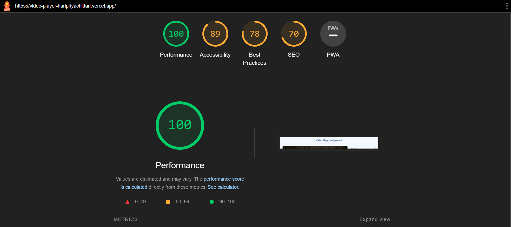

# Video player application

Demo URL: https://video-player-haripriyachittari.vercel.app/

## Tech Stack

- Next.js
- Typescript
- Tailwind

### Features

- **Autoplay**: Videos in the playlist automatically start playing when selected.
- **Direct Video Selection**: Clicking on a video in the playlist immediately plays it in the video player.
- **Autoplay on Video End**: When autoplay is enabled, the next video in the playlist automatically starts playing when the current video ends, ensuring a seamless viewing experience without user intervention
- **Reorder Playlist**: Users can drag and drop playlist items to reorder them according to their preferences.
- **Search Playlist**: Users can search the playlist by title, enabling quick navigation to specific videos.
- **Persistent Playback**: The application remembers the last played video and its playback position, ensuring users can resume watching from where they left off even after refreshing the page.
- **Mobile Responsive**: The application is optimized for mobile devices as well, ensuring a seamless viewing experience across different screen sizes.

### Lighthouse score

### Instructions to run

- `npm install`
- `npm run dev`
